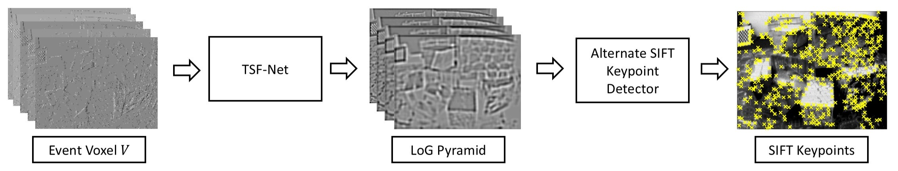
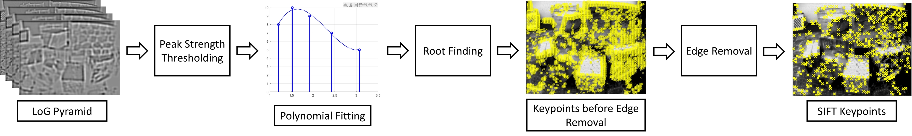

# E2SIFT: Neuromorphic SIFT via Direct Feature Pyramid Recovery from Events
This is the official implementation of the IEEE ICIP 2024 paper titled [E2SIFT: Neuromorphic SIFT via Direct Feature Pyramid Recovery from Events  ](https://doi.org/10.1109/ICIP51287.2024.10647465).

<br>

<div align="center">
  
  <br>
  Overall workflow of the proposed E2SIFT pipeline.
</div>

<br>

<div align="center">
  
  <br>
  Overall workflow of the proposed alternate keypoint detection.
</div>

## ⚠️Prerequisites
The code is tested on Linux with the following prerequisites:
1. Python 3.12
2. PyTorch 1.11.0 (CUDA 11.3)
3. MATLAB R2021a
4. VLFeat 0.9.21
5. pip install yt-dlp
pip install -U yt-dlp secretstorage
Remaining libraries are available in [requirements.txt](https://github.com/engrchrishenry/loc_aware_video_dedup/blob/main/requirements.txt)

## Installation

- Clone this repository
   ```bash
   git clone https://github.com/engrchrishenry/E2SIFT.git
   cd E2SIFT
   ```

- Create conda environment
   ```bash
   conda create --name e2sift python=3.13
   conda activate e2sift
   ```

- Install dependencies
  1. Install [PyTorch](https://pytorch.org/get-started/locally/).
  2. Install [FFmpeg](www.ffmpeg.org/download.html).
  3. The remaining packages can be installed via:
     ```bash
     pip install -r requirements.txt
     ```

## Dataset Preparation

<!-- ### Option 1: Use Pre-computed Data -->

<!--Download -->

<!--### Option 2: Prepare dataset from scratch -->

### Download Dataset
- Event Camera Dataset ([Download Here](https://rpg.ifi.uzh.ch/davis_data.html))

   The paper uses videos categorized as "Duplicate Scene Videos (DSVs)". The datasets contains a total of 7,558 DSVs labelled as 'ND' in [annotations.json](https://github.com/MKLab-ITI/FIVR-200K/blob/master/dataset/annotation.json). We provide [youtube_ids_ND.txt](https://github.com/engrchrishenry/loc_aware_video_dedup/blob/main/data/youtube_ids_ND.txt) which contains IDs of all DSVs. Only 4,960 DSVs were available for download at the time of writing our paper. The list of 4,960 videos used in our experiments is provided in [FIVR_available_videos.txt](https://github.com/engrchrishenry/loc_aware_video_dedup/blob/main/data/FIVR_available_videos.txt).

- [Vimeo-90k Dataset](http://toflow.csail.mit.edu)

  The list of vimeo video links is available [here](https://data.csail.mit.edu/tofu/dataset/original_video_list.txt). We provide a helper script to batch download the videos.
  ```bash
  cd data_processing/
  python download_vimeo90k.py --video_links data/original_video_list.txt --out_path <ouptut_directory> --cores 2
  ```
  Use less `--cores` to avoid "HTTP Error 429: Too Many Requests".

  `download_vimeo90k.py` downloads the lowest quality video available (without audio). Modify the `ydl_opts` in `download_vimeo90k.py` to change this behavior.

  Rename video files and folders (important for synthetic event generation via ESIM)
  ```bash
  python rename_vimeo90k.py --root_dir <vimeo90k_dataset_path>
  ```

  Extract and resize video frames (required for synthetic event generation via ESIM)
  ```bash
  python resize_vimeo90k_multi_core.py --video_dir <vimeo90k_dataset_path> --out_path <ouptut_directory> --res <width:height> --cores -1
  ```
  Use `240:180` for `<width:height>` if you want to be consistent with the paper.

## Citation

If you use this work, please cite:

```bibtex
@INPROCEEDINGS{10647465,
  author={Henry, Chris and Maharjan, Paras and Li, Zhu and York, George},
  booktitle={2024 IEEE International Conference on Image Processing (ICIP)}, 
  title={E2SIFT: Neuromorphic SIFT via Direct Feature Pyramid Recovery from Events}, 
  year={2024},
  volume={},
  number={},
  pages={2786-2792},
  keywords={Thresholding (Imaging);Neuromorphics;Detectors;Transforms;Streaming media;Vision sensors;Cameras;neuromorphic vision sensor;event camera;scale-invariant feature transform;SIFT;keypoint detection},
  doi={10.1109/ICIP51287.2024.10647465}}

```

<mark>⚠️You may also explore our work on event-based object detection [here](). Consider citing the following:</mark>

<!--
```bibtex
@INPROCEEDINGS{10095417,
  author={Henry, Chris and Liao, Rijun and Lin, Ruiyuan and Zhang, Zhebin and Sun, Hongyu and Li, Zhu},
  booktitle={ICASSP 2023 - 2023 IEEE International Conference on Acoustics, Speech and Signal Processing (ICASSP)}, 
  title={Lightweight Fisher Vector Transfer Learning for Video Deduplication}, 
  year={2023},
  volume={},
  number={},
  pages={1-5},
  keywords={Computational modeling;Transfer learning;Transforms;Multilayer perceptrons;Signal processing;Robustness;Encoding;Video deduplication;near-duplicate video detection;near-duplicate video copy detection;fisher vector aggregation},
  doi={10.1109/ICASSP49357.2023.10095417}}
```
-->

## Acknowledgements

This work was supported by the National Science Foundation (NSF) under Award 2148382.

- [TSF-Net](ieeexplore.ieee.org/document/10275101/) model implementation were adapted from: https://github.com/parasmaharjan/TSFNet  
- Some parts of the event data processing were adapted from: https://github.com/uzh-rpg/rpg_e2vid

We gratefully acknowledge the authors and contributors for making their work publicly available.

## Contact
In case of questions, feel free to contact at chffn@umsystem.edu or engr.chrishenry@gmail.com

