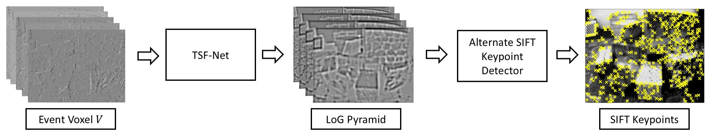
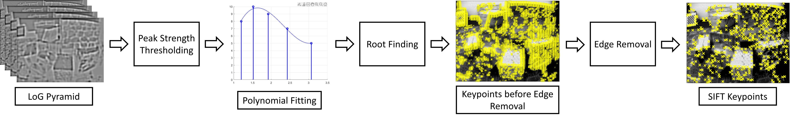
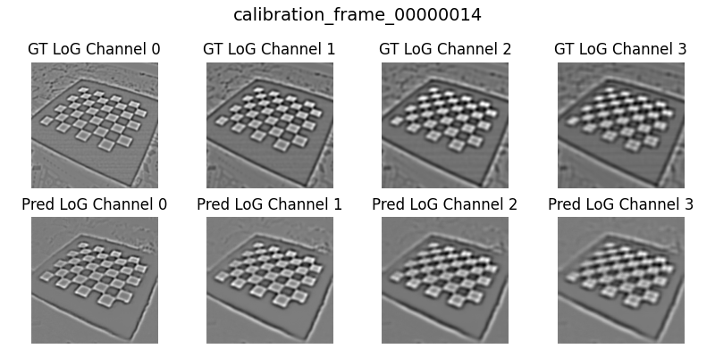
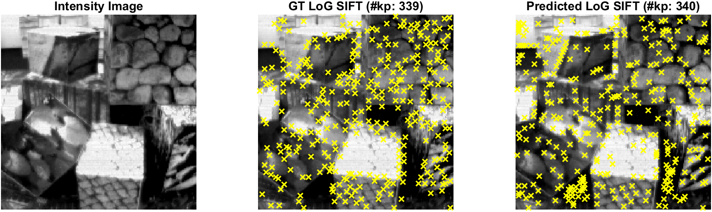

# E2SIFT: Neuromorphic SIFT via Direct Feature Pyramid Recovery from Events
This is the official implementation of the IEEE ICIP 2024 paper titled [E2SIFT: Neuromorphic SIFT via Direct Feature Pyramid Recovery from Events](https://doi.org/10.1109/ICIP51287.2024.10647465).

<br>

<p align="center">
  
  <br>
  Overall workflow of the proposed E2SIFT pipeline.
</div>

<br>

<p align="center">
  
  <br>
  Overall workflow of the proposed alternate keypoint detection.
</div>

## Table of Contents
- [Prerequisites](#prerequisites)
- [Installation](#installation)
- [Download Links](#download-links)
- [Quick Start](#quick-start)
- [Dataset Preparation from Scratch](#dataset-preparation-from-scratch)
- [Events to LoG Pyramid Recovery](#events-to-log-pyramid-recovery)
- [Neuromorphic SIFT Keypoint Detector](#neuromorphic-sift-keypoint-detector-matlab)
- [Citation](#citation)
- [Acknowledgements](#acknowledgements)
- [Contact](#contact)

## Prerequisites
The code was tested on Linux with the following prerequisites:
1. Python 3.13
2. PyTorch 2.7.1 (CUDA 11.8)
3. MATLAB R2021a
4. VLFeat 0.9.21

Remaining libraries are available in [requirements.txt](https://github.com/engrchrishenry/loc_aware_video_dedup/blob/main/requirements.txt)

## Installation

- Clone this repository
   ```bash
   git clone https://github.com/engrchrishenry/E2SIFT.git
   cd E2SIFT
   ```

- Create conda environment
   ```bash
   conda create --name e2sift python=3.13
   conda activate e2sift
   ```

- Install dependencies
  1. Install [PyTorch](https://pytorch.org/get-started/locally/).
  2. Install [FFmpeg](www.ffmpeg.org/download.html).
  3. The remaining packages can be installed via:
     ```bash
     pip install -r requirements.txt
     ```
  4. For running MATLAB scripts, you are required to install [VLFeat](https://www.vlfeat.org/download.html).

## Download Links
- [Precomputed datasets](https://mailmissouri-my.sharepoint.com/:f:/g/personal/chffn_umsystem_edu/IgCvKBoXFMn0Rb_Lo3yjXsKTASQbyxG3cxb9zsOKYhr3GD0?e=oRzZqa) (as used in the E2SIFT paper)
- [Pre-trained weights](https://mailmissouri-my.sharepoint.com/:f:/g/personal/chffn_umsystem_edu/IgCmFLuvjcT_SJyhmdnvHdVHAZeaz390WAU7tOtn1WIQrnk?e=Ny8GT9)

## Quick Start
> ⚠️ Note: To reproduce the results reported in the paper, use a LoG pyramid clipping value of $\pm 0.2$ (instead of $\pm 0.15$ as mistakenly stated in the paper).

- Complete the steps in the [Installation](#installation) section to set up the environment and dependencies.
- Create directories.
  ```bash
  mkdir datasets weights
  ```
  
- Download and place the [precomputed datasets](https://mailmissouri-my.sharepoint.com/:f:/g/personal/chffn_umsystem_edu/IgCvKBoXFMn0Rb_Lo3yjXsKTASQbyxG3cxb9zsOKYhr3GD0?e=oRzZqa) inside the `datasets` folder in the parent directory.
  
  ```bash
  # Unzip Event Camera Dataset sequences
  unzip datasets/ecd.zip -d datasets

  # Unzip Vimeo-90K Dataset (ESIM-generated)
  unzip datasets/vimeo_90k_esim.zip -d datasets
  ```
- Download and place the [pre-trained weights](https://mailmissouri-my.sharepoint.com/:f:/g/personal/chffn_umsystem_edu/IgCmFLuvjcT_SJyhmdnvHdVHAZeaz390WAU7tOtn1WIQrnk?e=Ny8GT9) inside the `weights` folder in the parent directory.
- Train network for LoG pyramid recovery
  ```bash
  python train.py --vox_path datasets/ecd/train/vox datasets/vimeo_90k_esim/train/vox \
    --log_path datasets/ecd/train/log datasets/vimeo_90k_esim/train/log \
    --vox_path_valid datasets/ecd/test_all/vox \
    --log_path_valid datasets/ecd/test_all/log \
    --out_path logs/ \
    --dct_min datasets/dct_min.npy \
    --dct_max datasets/dct_max.npy \
    --vox_clip -2.5 2.5 \
    --log_clip -0.2 0.2 \
    --batch_size 32 \
    --epochs 200 \
    --init_lr 0.0001 \
    --gpu_id 0 \
    --n_workers 4
  ```
- Test network for LoG pyramid recovery
  ```bash
  python test.py --vox_path datasets/ecd/test_per_seq/boxes_6dof/vox \
    --log_path datasets/ecd/test_per_seq/boxes_6dof/log \
    --weights weights/e2sift_weights.pth \
    --out_path output/pred/boxes_6dof/ \
    --dct_min datasets/dct_min.npy \
    --dct_max datasets/dct_max.npy \
    --vox_clip -2.5 2.5 \
    --log_clip -0.2 0.2 \
    --batch_size 32 \
    --n_workers 4 \
    --plot
  ```
  The command above tests on the `boxes_6dof` sequence. Update `--vox_path`, `--log_path`, and `--out_path` for testing on other sequences.
- Compute matching accuracy for SIFT keypoints detected via ground truth LoG and predicted LoG pyramid

  - Run [gt_vs_pred_log_sift.m](https://github.com/engrchrishenry/E2SIFT/blob/main/neuromorphic_sift/gt_vs_pred_log_sift.m) after modifying the paths and parameters (if needed).
  - Run `gt_vs_pred_log_sift.m` separately for each sequence in `ecd/test_per_seq` to reproduce results from Table 2 in E2SIFT paper.  

## Dataset Preparation from Scratch

The E2SIFT paper used a subset from the [Event Camera Dataset](https://rpg.ifi.uzh.ch/davis_data.html) (real events) and [Vimeo-90k Dataset](http://toflow.csail.mit.edu) ([ESIM](https://github.com/uzh-rpg/rpg_vid2e/tree/master)-generated synthetic events) for training and testing. A subset from the [Event Camera Dataset](https://rpg.ifi.uzh.ch/davis_data.html) (real events) was used for testing.
  
### [Event Camera Dataset](https://rpg.ifi.uzh.ch/davis_data.html)

- Download sequences:
  
  We provide links to the train and test sequences used in the E2SIFT paper. The 'office_zigzag.zip' sequence was excluded as explained in the paper.

  Download the train and test sequences as mentioned in the E2SIFT paper.

  ```bash
  # Download train sequences
  wget -i data/ecd_train_links.txt -P ecd/train

  # Download test sequences
  wget -i data/ecd_test_links.txt -P ecd/test
  ```

  Unzip train/test sequences

  ```bash
  # Unzip train sequences
  for f in ecd/train/*.zip; do unzip -o "$f" -d "${f%.zip}"; done
  
  # Unzip test sequences
  for f in ecd/test/*.zip; do unzip -o "$f" -d "${f%.zip}"; done
  ```

  [Optional] Remove the .zip files to save storage space.
  ```bash
  # Delete train sequences
  rm ecd/train/*.zip

  # Delete test sequences
  rm ecd/test/*.zip
  ```

- Event voxel generation

  ```bash
  # Generate event voxels for training the model
  python prep_data_ecd_multi_core.py --events_dir ecd/train/ --out_dir <output_path>

  # Generate event voxels for testing the model
  python prep_data_ecd_multi_core.py --events_dir ecd/test/ --out_dir <output_path>
  ```

  Usage:

  ```bash
  options:
    -h, --help            show this help message and exit
    --events_dir EVENTS_DIR
                          Path to directory containing sequences from the Event Camera Dataset
    --out_dir OUT_DIR     Path to output directory
    --bins BINS           Number of bins for event voxel generation
    --dur_sec DUR_SEC     Event window duration in seconds
    --res RES             Event camera resolution (e.g., '240:180')
    --events_per_px EVENTS_PER_PX
                          Number of events per pixel
    --kp_th KP_TH         Keypoint threshold for rejecting blank frames. None to ignore.
    --sd_th SD_TH         Standard deviation threshold. None to ignore.
    --range_th RANGE_TH   Range (max value - min value) threshold. None to ignore.
    --th_hist TH_HIST     Clipping threshold for histogram plotting. Value between 0 and 100, e.g., 99.9 means clipping at 99.9 percentile.
    --plot                Save plots.
    --cores CORES         Number of cores to use. -1 -> use all cores.
  ```

- Generate Laplacian of Gaussian (LoG)

  Run [gen_log_data.m](https://github.com/engrchrishenry/E2SIFT/blob/main/data_processing/LoG_generation/gen_LoG_data.m) in MATLAB after updating the following variables:
  - `images_dir = 'images' directory path generated after running prep_data_ecd_multi_core.py`
  - `output_dir = <output_log_dir>`
  - `n_cores = <no_of_cpu_cores>`

### [Vimeo-90k Dataset](http://toflow.csail.mit.edu)

  - Download videos:

    The list of vimeo video links is available [here](https://data.csail.mit.edu/tofu/dataset/original_video_list.txt). We provide a helper script to batch download the videos.
    ```bash
    cd data_processing/
    python download_vimeo90k.py --video_links data/original_video_list.txt --out_path <output_directory> --cores 2
    ```
    Use less `--cores` to avoid "HTTP Error 429: Too Many Requests".

    `download_vimeo90k.py` downloads the lowest quality video available   (without audio). Modify the `ydl_opts` in `download_vimeo90k.py` to change this behavior.

  - Rename video files and folders (important for synthetic event generation via [ESIM](https://github.com/uzh-rpg/rpg_vid2e/tree/master)). The [generate_events.py](https://github.com/uzh-rpg/rpg_vid2e/blob/master/esim_torch/scripts/generate_events.py) script from [ESIM](https://github.com/uzh-rpg/rpg_vid2e/tree/master) will fail without renaming due to the presence special characters in video filenames.
    ```bash
    python rename_vimeo90k.py --root_dir <vimeo90k_dataset_path>
    ```

  - Resize videos (important for synthetic event generation via [ESIM](https://github.com/uzh-rpg/rpg_vid2e/tree/master)).
    ```bash
    python resize_vimeo90k_multi_core.py --video_dir <vimeo90k_dataset_path> --out_path <output_directory> --res <width:height> --cores -1
    ```
    Use `224:160` for `<width:height>` if you want to be consistent with the paper.

- Synthesize events
  
  Follow the instructions [here](https://github.com/uzh-rpg/rpg_vid2e/tree/master) to setup ESIM and build the python binding with GPU support. Use a different conda environment with the exact versions of the dependencies reqired to run ESIM with GPU support. Once ESIM is setup:

  Upsample Vimeo-90k videos to a higher FPS via [upsample.py](https://github.com/uzh-rpg/rpg_vid2e/blob/master/upsampling/upsample.py). Sample command:
  ```bash
  python upsampling/upsample.py --input_dir=<resized_videos_path> --output_dir=<upsampled_output_path>
  ```

  Generate synthetic events via [generate_events.py](https://github.com/uzh-rpg/rpg_vid2e/blob/master/esim_torch/scripts/generate_events.py). Sample command:

  ```bash
  python esim_torch/scripts/generate_events.py --input_dir=<upsampled_videos_path> \
    --output_dir=<events_output_path> \
    --contrast_threshold_neg=0.2 \
    --contrast_threshold_pos=0.2 \
    --refractory_period_ns=0
  ```
  
- Event voxel generation

  Generate event voxels for training the model.

  ```bash
  python prep_data_esim_multi_core.py --events_dir <synthetic_events_path> \
    --upsamp_frames_dir <upsampled_frames_path> \
    --out_dir <output_path>
  ```
  
  Usage:

  ```bash
  options:
    -h, --help            show this help message and exit
    --events_dir EVENTS_DIR
                          Path to directory containing ESIM-generated synthetic events
    --upsamp_frames_dir UPSAMP_FRAMES_DIR
                          Path to directory containing upsampled frames
    --out_dir OUT_DIR     Path to output directory
    --bins BINS           Number of bins for event voxel generation
    --dur_sec DUR_SEC     Event window duration in seconds
    --res RES             Event camera resolution (e.g., '224:160')
    --events_per_px EVENTS_PER_PX
                          Number of events per pixel
    --kp_th KP_TH         Keypoint threshold for rejecting blank frames. None to ignore.
    --sd_th SD_TH         Standard deviation threshold. None to ignore.
    --range_th RANGE_TH   Range (max value - min value) threshold. None to ignore.
    --th_hist TH_HIST     Clipping threshold for histogram plotting. Value between 0 and 100, e.g., 99.9 means clipping at 99.9 percentile.
    --plot                Save plots.
    --cores CORES         Number of cores to use. -1 -> use all cores.
  ```

- Generate Laplacian of Gaussian (LoG)

  Run [gen_log_data.m](https://github.com/engrchrishenry/E2SIFT/blob/main/data_processing/LoG_generation/gen_LoG_data.m) in MATLAB after updating the following variables:
  - `images_dir = 'images' directory path generated after running prep_data_esim_multi_core.py`
  - `output_dir = <output_log_dir>`
  - `n_cores = <no_of_cpu_cores>`

## Events to LoG Pyramid Recovery
> ⚠️Important note: LoG pyramid clipping value $\pm c_{log}$ was mistakenly mentioned as $\pm 0.15$ in the E2SIFT paper. To reproduce the paper results, use $\pm c_{log}=\pm 0.2$.

- ### Training
  To train using [precomputed datasets](https://mailmissouri-my.sharepoint.com/:f:/g/personal/chffn_umsystem_edu/IgCvKBoXFMn0Rb_Lo3yjXsKTASQbyxG3cxb9zsOKYhr3GD0?e=oRzZqa) and using the same parameters as in E2SIFT paper, run the following:

  ```bash
  python train.py --vox_path datasets/ecd/train/vox datasets/vimeo_90k_esim/train/vox \
    --log_path datasets/ecd/train/log datasets/vimeo_90k_esim/train/log \
    --vox_path_valid datasets/ecd/test_all/vox \
    --log_path_valid datasets/ecd/test_all/log \
    --out_path logs/ \
    --dct_min datasets/dct_min.npy \
    --dct_max datasets/dct_max.npy \
    --vox_clip -2.5 2.5 \
    --log_clip -0.2 0.2 \
    --batch_size 32 \
    --epochs 200 \
    --init_lr 0.0001 \
    --gpu_id 0 \
    --n_workers 4
  ```

  Usage:

  ```bash
  options:
    -h, --help            show this help message and exit
    --vox_path VOX_PATH [VOX_PATH ...]
                          One or more paths to directories containing training voxel .npz files
    --log_path LOG_PATH [LOG_PATH ...]
                          One or more paths to directories containing training LoG pyramid .mat files
    --vox_path_valid VOX_PATH_VALID [VOX_PATH_VALID ...]
                          One or more paths to directories containing validation voxel .npz files
    --log_path_valid LOG_PATH_VALID [LOG_PATH_VALID ...]
                          One or more paths to directories containing validation LoG pyramid .mat files
    --out_path OUT_PATH   Path to output logs
    --vox_clip min max    Min and max clipping value for event voxels
    --log_clip min max    Min and max clipping value for LoG pyramid
    --dct_min DCT_MIN     Path to dct_min.npy (generated via get_dct_min_max.py)
    --dct_max DCT_MAX     Path to dct_max.npy (generated via get_dct_min_max.py)
    --batch_size BATCH_SIZE
                          Batch size
    --epochs EPOCHS       Number of epochs
    --init_lr INIT_LR     Initial learning rate
    --gpu_id GPU_ID       GPU ID to use for training/validation
    --n_workers N_WORKERS
                          Number of workers for data loading
  ```

- ### Testing
  Use the [pre-trained weights](https://mailmissouri-my.sharepoint.com/:f:/g/personal/chffn_umsystem_edu/IgCmFLuvjcT_SJyhmdnvHdVHAZeaz390WAU7tOtn1WIQrnk?e=Ny8GT9) (placed inside [weights](https://github.com/engrchrishenry/E2SIFT/tree/main/weights) folder) and the [precomputed datasets](https://mailmissouri-my.sharepoint.com/:f:/g/personal/chffn_umsystem_edu/IgCvKBoXFMn0Rb_Lo3yjXsKTASQbyxG3cxb9zsOKYhr3GD0?e=oRzZqa) (placed inside [datasets](https://github.com/engrchrishenry/E2SIFT/tree/main/datasets) folder) to reproduce results from Table 1 in E2SIFT. Run the following:

  ```bash
  python test.py --vox_path datasets/ecd/test_per_seq/boxes_6dof/vox \
    --log_path datasets/ecd/test_per_seq/boxes_6dof/log \
    --weights weights/e2sift_weights.pth \
    --out_path output/pred/boxes_6dof/ \
    --dct_min datasets/dct_min.npy \
    --dct_max datasets/dct_max.npy \
    --vox_clip -2.5 2.5 \
    --log_clip -0.2 0.2 \
    --batch_size 32 \
    --n_workers 4 \
    --plot
  ```

  The command above is for the `boxes_6dof` sequence from the [Event Camera Dataset](https://rpg.ifi.uzh.ch/davis_data.html). Modify the paths and run the script again for different sequences in `ecd/test_per_seq/`.
  
  
  Usage:

  ```bash
  options:
    -h, --help            show this help message and exit
    --vox_path VOX_PATH [VOX_PATH ...]
                          One or more paths to directories containing test voxel .npz files
    --log_path LOG_PATH [LOG_PATH ...]
                          One or more paths to directories containing test LoG pyramid .mat files
    --weights WEIGHTS     Path to trained weights
    --out_path OUT_PATH   Path to output predicted LoG pyramid
    --vox_clip min max    Min and max clipping value for event voxels
    --log_clip min max    Min and max clipping value for LoG pyramid
    --dct_min DCT_MIN     Path to dct_min.npy (generated via get_dct_min_max.py)
    --dct_max DCT_MAX     Path to dct_max.npy (generated via get_dct_min_max.py)
    --batch_size BATCH_SIZE
                          Batch size
    --n_workers N_WORKERS
                          Number of workers for data loading
    --plot                Save plots. If not set, only .mat files will be saved
  ```

  <p align="center">
  
  <br>
  Ground truth LoG pyramid vs Predicted LoG pyramid.
  </div>

## Neuromorphic SIFT Keypoint Detector (MATLAB)

- Modify the paths and parameters (if needed) in [gt_vs_pred_log_sift.m](https://github.com/engrchrishenry/E2SIFT/blob/main/neuromorphic_sift/gt_vs_pred_log_sift.m).
- Run [gt_vs_pred_log_sift.m](https://github.com/engrchrishenry/E2SIFT/blob/main/neuromorphic_sift/gt_vs_pred_log_sift.m) to compute the matching accuracy between the SIFT keypoints detected via the ground truth LoG pyramid and the predicted LoG pyramid.
- Run `gt_vs_pred_log_sift.m` separately for each sequence in `ecd/test_per_seq` to reproduce results from Table 2 in E2SIFT paper. `gt_vs_pred_log_sift.m` will output plots and a `results.txt` file. Sample plot and a snippet from the `results.txt` file are shown below: 

  <p align="center">
  
  <br>
  SIFT keypoints detected via the ground truth LoG pyramid and the predicted LoG pyramid.
  </div>

  <br>

  ```text
  boxes_6dof_frame_00001288.png  ->  accuracy: 0.613924  matches: 194
  boxes_6dof_frame_00001289.png  ->  accuracy: 0.737589  matches: 208
  boxes_6dof_frame_00001290.png  ->  accuracy: 0.533597  matches: 135
  boxes_6dof_frame_00001291.png  ->  accuracy: 0.598706  matches: 185
  boxes_6dof_frame_00001292.png  ->  accuracy: 0.546667  matches: 164
  boxes_6dof_frame_00001293.png  ->  accuracy: 0.680000  matches: 204
  boxes_6dof_frame_00001294.png  ->  accuracy: 0.589905  matches: 187

  =================================
  Final Average Accuracy: 0.54184
  ```

## Citation

If you use this code, please cite:

```bibtex
@INPROCEEDINGS{10647465,
  author={Henry, Chris and Maharjan, Paras and Li, Zhu and York, George},
  booktitle={2024 IEEE International Conference on Image Processing (ICIP)}, 
  title={E2SIFT: Neuromorphic SIFT via Direct Feature Pyramid Recovery from Events}, 
  year={2024},
  volume={},
  number={},
  pages={2786-2792},
  keywords={Thresholding (Imaging);Neuromorphics;Detectors;Transforms;Streaming media;Vision sensors;Cameras;neuromorphic vision sensor;event camera;scale-invariant feature transform;SIFT;keypoint detection},
  doi={10.1109/ICIP51287.2024.10647465}}

```

<!--
<mark>⚠️You may also explore our work on event-based object detection [here](). Consider citing the following:</mark>


```bibtex
@INPROCEEDINGS{10095417,
  author={Henry, Chris and Liao, Rijun and Lin, Ruiyuan and Zhang, Zhebin and Sun, Hongyu and Li, Zhu},
  booktitle={ICASSP 2023 - 2023 IEEE International Conference on Acoustics, Speech and Signal Processing (ICASSP)}, 
  title={Lightweight Fisher Vector Transfer Learning for Video Deduplication}, 
  year={2023},
  volume={},
  number={},
  pages={1-5},
  keywords={Computational modeling;Transfer learning;Transforms;Multilayer perceptrons;Signal processing;Robustness;Encoding;Video deduplication;near-duplicate video detection;near-duplicate video copy detection;fisher vector aggregation},
  doi={10.1109/ICASSP49357.2023.10095417}}
```
-->

## Acknowledgements

This work was supported by the National Science Foundation (NSF) under Award 2148382.

- [TSF-Net](ieeexplore.ieee.org/document/10275101/) model implementation were adapted from: https://github.com/parasmaharjan/TSFNet  
- Some parts of the event data processing were adapted from: https://github.com/uzh-rpg/rpg_e2vid

We gratefully acknowledge the authors and contributors for making their work publicly available.

## Contact
If you have questions or issues regarding the code, feel free to contact: chffn@umsystem.edu or engr.chrishenry@gmail.com

